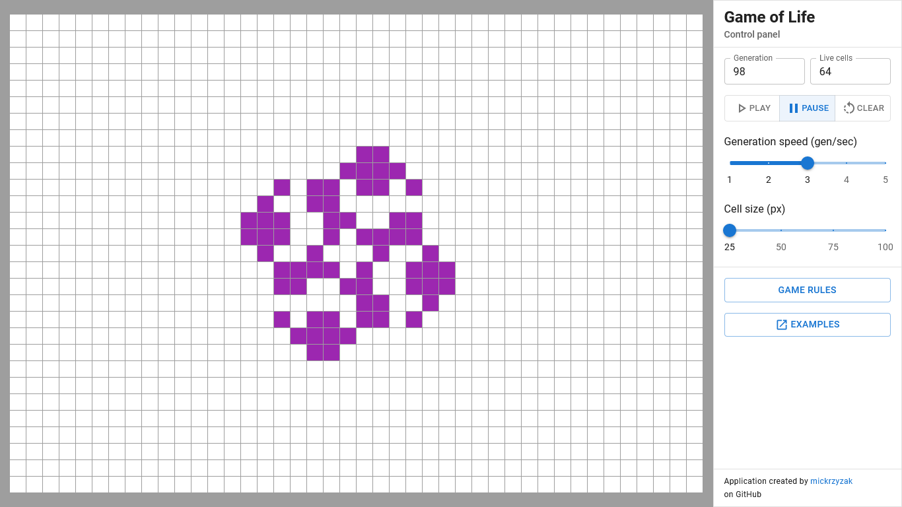

# Game of Life

### What is it?

#### Explanation

> The **Game of Life**, also known simply as **Life**, is a cellular automaton devised by the British mathematician John Horton Conway in 1970. It is a **zero-player game**, meaning that its evolution is determined by its initial state, requiring no further input. One interacts with the Game of Life by creating an **initial configuration** and observing how it **evolves**. It is Turing complete and can simulate a universal constructor or any other Turing machine. [~ *Wikipedia*](https://en.wikipedia.org/wiki/Conway%27s_Game_of_Life)

#### Rules

1. Any live cell with two or three live neighbours survives.
2. Any dead cell with three live neighbours becomes a live cell.
3. All other live cells die in the next generation. Similarly, all other dead cells stay dead.

### How does it work?

Application is made in **React** with **Redux** and **MUI**. The project template was created by the **Create React App**, the code was written in **TypeScript** and **JSX**.

**The online demo is available [here](https://mickrzyzak.github.io/game-of-life/).**

## Technologies
- [React](https://github.com/facebook/react)
- [Create React App](https://github.com/facebook/create-react-app)
- [React Redux](https://github.com/reduxjs/react-redux)
- [MUI](https://github.com/mui-org/material-ui)
- [TypeScript](https://github.com/microsoft/TypeScript)

## Requirements
- Node.js and npm
- Browser *(Firefox or Chrome recommended)*

## Setup
1. `npm install` Install Node dependencies
2. `npm start` Run the application
